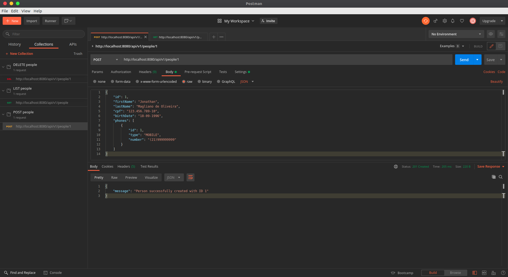

# PersonAPI Manager
- O teor do projeto consiste em utilizar a modelagem de arquitetura API REST com Spring Boot e Java para desenvolver um sistema de cadastro e gerenciamento de pessoas de uma organização. Desafio proposto pelo bootcamp da empresa Everis.

## Desenvolvimento

* Setup inicial de projeto com o Spring Boot Initializr.
* Criação de modelo de dados para o mapeamento de entidades em bancos de dados.
* Desenvolvimento de operações de gerenciamento de usuários (Cadastro, leitura, atualização e remoção de pessoas de um sistema).
* Relação de cada uma das operações acima com o padrão arquitetural REST.
* Desenvolvimento de testes unitários para validação das funcionalidades.
* Implementação do sistema na nuvem através do Heroku.
* Testes via Postman.

Para executar o projeto no terminal, digite o seguinte comando:

```shell script
mvn spring-boot:run 
```

Após executar o comando acima, basta apenas abrir o seguinte endereço e visualizar a execução do projeto:

```
http://localhost:8080/api/v1/people
```


São necessários os seguintes pré-requisitos para a execução do projeto desenvolvido:

* Java 11 ou versões superiores.
* Maven 3.6.3 ou versões superiores.
* Intellij IDEA Community Edition ou sua IDE favorita.
* Controle de versão GIT instalado na sua máquina.
* Conta no GitHub para o armazenamento na nuvem.
* Conta no Heroku para o deploy do projeto na nuvem.

Material de apoio:

* [SDKMAN! para gerenciamento e instalação do Java e Maven](https://sdkman.io/)
* [Referência do Intellij IDEA Community para download](https://www.jetbrains.com/idea/download)
* [Palheta de atalhos de comandos do Intellij](https://resources.jetbrains.com/storage/products/intellij-idea/docs/IntelliJIDEA_ReferenceCard.pdf)
* [Site oficial do Spring](https://spring.io/)
* [Site oficial do Spring Initializr para setup do projeto](https://start.spring.io/)
* [Site oficial do Heroku](https://www.heroku.com/)
* [Site oficial do GIT](https://git-scm.com/)
* [Site oficial do GitHub](http://github.com/)
* [Documentação oficial do Lombok](https://projectlombok.org/)
* [Documentação oficial do Map Struct](https://mapstruct.org/)
* [Referência para o padrão arquitetural REST](https://restfulapi.net/)
* [Postman - API Development](https://www.postman.com/)
